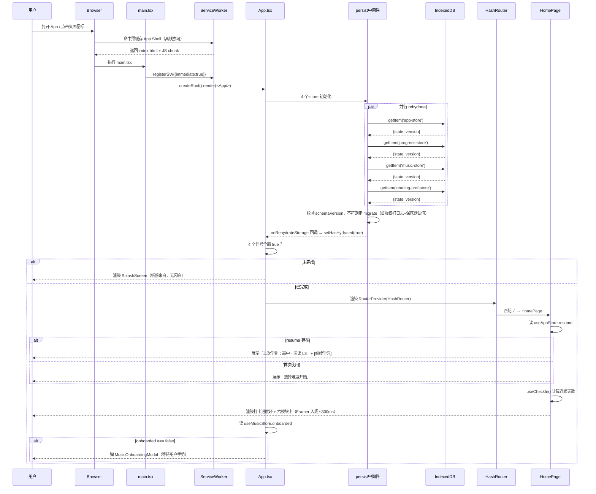
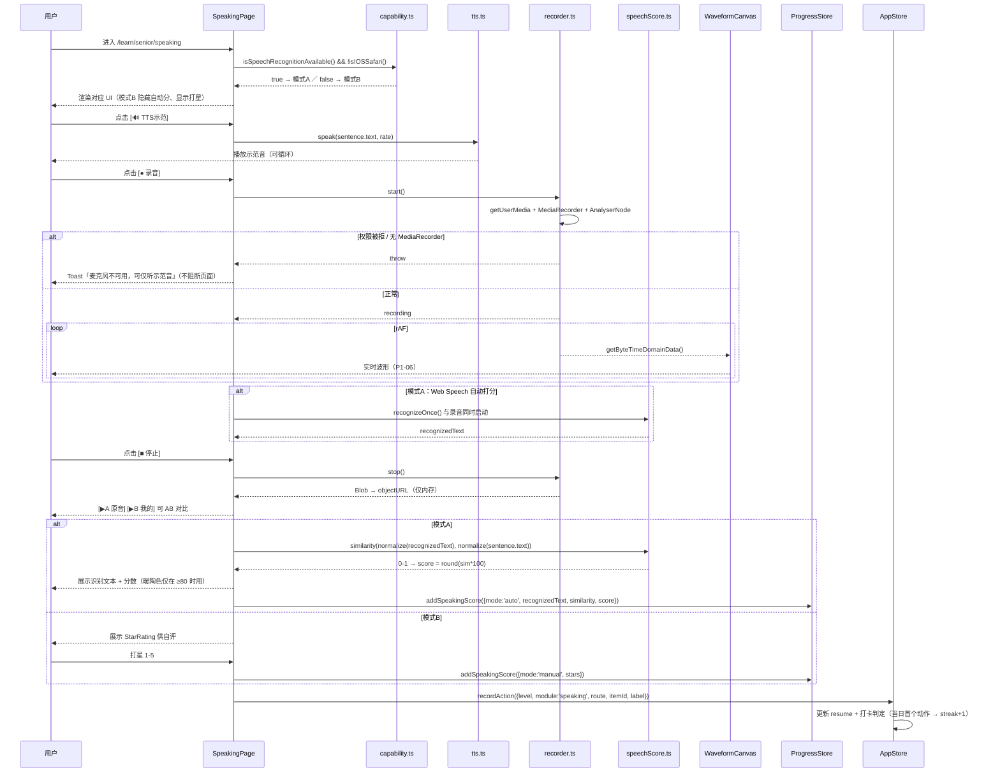
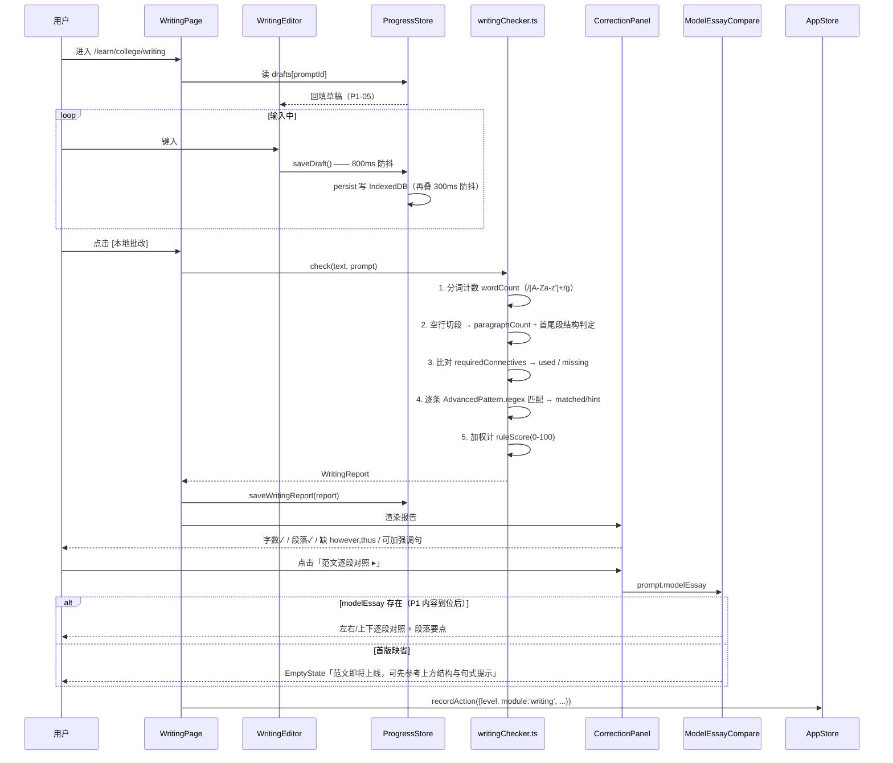
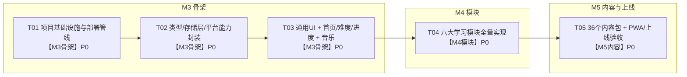

# 雅思 PWA 英语学习应用 — 系统架构设计 & 任务分解

> 版本：v1.0　|　产出：架构师 高见远　|　日期：2026-07-31
> 上游输入：`docs/prd.md`（产品经理 许清楚，v0.1）
> 下游接收：工程师 寇豆码（本文件即施工蓝图）
> 项目性质：**全新独立项目**。纯前端 PWA，无后端、无 API key、完全离线可用，手机竖屏优先。

---

## 0. 决策速查（主理人已锁定，工程师不得擅改）

| 项 | 决策 | 说明 |
|---|---|---|
| 框架 | Vite + React 18 + TypeScript | 严格模式 |
| 样式 | Tailwind CSS + Framer Motion | **严禁引入 MUI / Ant Design 等组件库** |
| 路由 | `HashRouter` | GitHub Pages 子路径刷新不 404 |
| 状态 | Zustand + `persist` 中间件 | 自定义 `StateStorage` 适配 **IndexedDB** |
| 存储 | IndexedDB（非 localStorage） | 断点续学核心；带 `schemaVersion` |
| PWA | vite-plugin-pwa（Workbox） | 预缓存 App Shell + 内容包 |
| 语音 | SpeechSynthesis + MediaRecorder + Web Speech API | 能力检测降级 |
| 音乐 | Web Audio API 实时合成 | 零音频文件；雨声/白噪/柔和琶音 |
| 部署 | GitHub Actions → GitHub Pages | 仓库 `MisterCharlesxiong/ielts-pwa` |
| Vite base | **`/ielts-pwa/`** | 线上 `https://mistercharlesxiong.github.io/ielts-pwa/` |

### 本轮新增确认（已纳入设计）

1. **阅读题首版统一为选择题 / 判断题**（`single` / `boolean`），保证纯离线点击即判分、可记录正确率，形成判分闭环。阅读模块首版**不做开放题**。
2. **打卡口径 = 当日完成 ≥1 个模块动作**才算打卡成功（防"打开即打卡"虚高）。具体见 §7.6。

### PRD 其余 5 项待确认项的默认处理（已定，无需再问）

| PRD 待确认项 | 架构默认处理 |
|---|---|
| ① 内容来源 | 首版使用**结构化占位数据**跑通全流程；`src/content/` 目录结构与 schema 即为 P2-01 JSON 导入规范，`contentLoader` 预留 `importPack()` 接口 |
| ④ 音乐首次触发 | 首次进入弹 `MusicOnboardingModal` 引导开启（浏览器要求用户手势才能 `AudioContext.resume()`）；开关与音量持久化，第二次起不再弹 |
| ⑥ iPad/大屏适配 | **手机竖屏优先**：全局 `max-w-[430px] mx-auto` 容器居中；平板/桌面仅居中窄屏，**不做多列响应式** |
| ⑦ 数据迁移 | IndexedDB 持久化对象统一带 `schemaVersion` 字段；`persist.migrate` 钩子留空实现（仅打日志），真正迁移脚本列 P2 |
| ③ 写作范文 | 首版先上"结构检查 + 连接词提示 + 高分句式提示"；`WritingPrompt.modelEssay` 字段**可选**，UI 层缺省时渲染"范文即将上线"占位，接口已预留（P1 填充即生效，无需改代码） |

---

## 1. 实现方案 + 框架选型

### 1.1 整体架构分层

```
┌──────────────────────────────────────────────────────────┐
│  Presentation 表现层                                       │
│  features/*（六模块页面 + 首页/难度/进度）                    │
│  components/ui · components/layout · components/music      │
├──────────────────────────────────────────────────────────┤
│  Hooks 编排层                                              │
│  useTTS · useRecorder · useBackgroundMusic · useCheckIn    │
│  useContent · useReducedMotion · useWordQueue              │
├──────────────────────────────────────────────────────────┤
│  State 状态层（Zustand，4 个 store 按变更频率切分）            │
│  useAppStore · useProgressStore · useMusicStore            │
│  useReadingPrefStore                                       │
├──────────────────────────────────────────────────────────┤
│  Lib 能力层（纯函数 / 浏览器 API 封装，全部可单测）             │
│  idb · zustandIdbStorage · capability · tts · recorder     │
│  speechScore · audioEngine · writingChecker · date         │
│  contentLoader                                             │
├──────────────────────────────────────────────────────────┤
│  Content 内容层（静态 JSON，动态 import 分包）                │
│  src/content/<level>/<module>.json                         │
└──────────────────────────────────────────────────────────┘
```

**关键设计原则：表现层不直接碰浏览器 API**。所有 `window.speechSynthesis`、`navigator.mediaDevices`、`AudioContext`、`indexedDB` 调用必须收敛到 `src/lib/`，组件只通过 `hooks/` 消费。这样 iOS Safari 降级、SSR 安全、单测 mock 都只需改一处。

### 1.2 状态分层（为什么切 4 个 store 而不是 1 个）

Zustand `persist` 每次 setState 都会触发一次序列化写盘。若把「答题进度」和「音乐音量拖动」放同一个 store，拖音量会连带把整个进度树反复写 IndexedDB，移动端会卡。故按**变更频率 + 数据体量**切分：

| Store | 持久化 key | 数据量 | 变更频率 | 说明 |
|---|---|---|---|---|
| `useAppStore` | `app-store` | 小 | 低 | 当前难度、断点续学指针、打卡、全局主题 |
| `useProgressStore` | `progress-store` | **大**（六级×六模块） | 中 | 各模块学习状态、错题本、成绩；写入做 300ms 防抖 |
| `useMusicStore` | `music-store` | 极小 | 高（拖音量） | 音乐开关/音轨/音量/已引导标记 |
| `useReadingPrefStore` | `reading-pref-store` | 极小 | 高（拖字号） | 专注阅读底色/字号/专注开关 |

### 1.3 数据流向

```
冷启动 → main.tsx 挂载 → persist 中间件从 IndexedDB 异步 rehydrate
   → App.tsx 监听 4 个 store 的 hasHydrated，全部 true 前渲染 SplashScreen
   → 全部 true 后渲染 <RouterProvider>（HashRouter）
   → 首页读取 useAppStore.resume 渲染「继续学习」卡片
   → 用户进入模块页 → useContent(level, module) 动态 import JSON
   → 用户产生学习动作 → useProgressStore.action() + useAppStore.recordAction()
   → recordAction 内部：① 更新 resume 指针 ② 触发 checkIn 判定
   → persist 防抖写回 IndexedDB
```

**单向数据流**：内容 JSON 只读；用户产生的一切可变数据只经 store action 写入，组件不得直接 mutate。

### 1.4 路由设计（HashRouter）

| 路径 | 页面 | 说明 |
|---|---|---|
| `/` | HomePage | 打卡环 + 继续学习 + 六模块入口 |
| `/levels` | LevelSelectPage | 六级卡片 + 各级进度 |
| `/learn/:level/words` | WordsPage | 单词卡 |
| `/learn/:level/grammar` | GrammarPage | 语法点 + 练习 |
| `/learn/:level/reading` | ReadingListPage | 篇目列表 |
| `/learn/:level/reading/:passageId` | ReadingFocusPage | 专注阅读 + 答题（**全屏，无导航**） |
| `/learn/:level/writing` | WritingPage | 题目 + 编辑 + 批改 |
| `/learn/:level/speaking` | SpeakingPage | 跟读双模式 |
| `/learn/:level/quiz` | QuizListPage | 套卷列表 |
| `/learn/:level/quiz/:quizId` | QuizRunnerPage | 计时答题 |
| `/learn/:level/quiz/:quizId/result` | QuizResultPage | 得分与分项 |
| `/wrongbook` | WrongBookPage | 错题本与重练 |
| `/progress` | ProgressPage | 模块×难度矩阵 + 成绩趋势 |

> `ReadingFocusPage` 与 `QuizRunnerPage` 使用**无壳布局**（不渲染 TopBar/BottomNav），满足 P0-07 隐藏导航与考试沉浸。路由配置里通过 `handle: { chrome: false }` 标记。

### 1.5 选型理由

- **Zustand 而非 Redux/Context**：persist 中间件开箱即用，可自定义异步 `StateStorage` 直连 IndexedDB；无 Provider 嵌套，selector 精准订阅，避免六模块页面互相 re-render。
- **自定义 IndexedDB StateStorage 而非 localStorage**：localStorage 同步阻塞主线程且 5MB 上限，装不下六级×六模块进度 + 写作草稿；IndexedDB 异步、容量大，且为后续存录音 Blob 留门。用 `idb-keyval`（1.5KB）而非完整 `idb`，够用且更轻。
- **Framer Motion 而非 CSS animation**：需要 spring 手感（翻牌 P1-01、进度环 P1-08）且要统一响应 `prefers-reduced-motion`，Framer 的 `MotionConfig reducedMotion="user"` 一行全局生效。
- **Tailwind + CSS 变量双轨**：护眼 token 用 CSS 变量声明（便于夜间墨屏运行时切换），Tailwind `theme.extend.colors` 引用变量，两边共用同一真源。
- **内容 JSON 动态 import 而非全量打包**：`import(\`../content/${level}/${module}.json\`)` 由 Vite 自动分包，首屏只加载 App Shell；Workbox 用 `globPatterns` 把内容 chunk 一并预缓存，离线仍可用。
- **不引入图表库**：P1-07 成绩趋势、P1-06 波形均用原生 SVG / Canvas 手写，省 40KB+。

---

## 2. 文件列表及相对路径

> 标注含义：**[M3]** 骨架阶段 · **[M4]** 模块阶段 · **[M5]** 内容填充阶段

### 2.1 根目录配置 [M3]

| 路径 | 说明 |
|---|---|
| `package.json` | 依赖与脚本（dev/build/preview/typecheck） |
| `tsconfig.json` | strict、path alias `@/* → src/*`、`resolveJsonModule: true` |
| `tsconfig.node.json` | vite.config 的 node 侧 tsconfig |
| `vite.config.ts` | **`base: '/ielts-pwa/'`** + VitePWA 配置 + alias |
| `tailwind.config.ts` | 护眼 token 主题扩展、字号三档、行高 1.9 |
| `postcss.config.js` | tailwindcss + autoprefixer |
| `index.html` | `<meta name="viewport" viewport-fit=cover>`、theme-color、apple-mobile-web-app |
| `.gitignore` | node_modules / dist / .DS_Store |
| `README.md` | 本地启动与部署说明 |
| `.github/workflows/deploy.yml` | Actions：build → upload-pages-artifact → deploy-pages |

### 2.2 public 静态资源 [M3]

| 路径 | 说明 |
|---|---|
| `public/favicon.svg` | 苔绿叶片图标 |
| `public/icons/icon-192.png` | PWA 图标 |
| `public/icons/icon-512.png` | PWA 图标 |
| `public/icons/maskable-512.png` | maskable（Android 自适应） |
| `public/apple-touch-icon.png` | iOS 添加到主屏 |

### 2.3 入口与全局 [M3]

| 路径 | 说明 |
|---|---|
| `src/main.tsx` | createRoot、引入 index.css、注册 SW（virtual:pwa-register） |
| `src/App.tsx` | Hydration 门闸 + MotionConfig + ErrorBoundary + 音乐引导挂载点 |
| `src/router.tsx` | createHashRouter 路由表（含 `chrome:false` 标记） |
| `src/styles/index.css` | Tailwind 三指令 + CSS 变量 token + 夜间态 `.theme-night` |
| `src/vite-env.d.ts` | Vite 类型 + `virtual:pwa-register` 声明 |

### 2.4 类型定义 [M3]

| 路径 | 说明 |
|---|---|
| `src/types/content.ts` | Word/GrammarPoint/ReadingPassage/Question/WritingPrompt/FollowReadSentence/Quiz/ContentPack |
| `src/types/progress.ts` | 各模块进度、打卡、成绩、错题、写作报告 |
| `src/types/common.ts` | LevelId/ModuleId/ResumePointer/枚举 |
| `src/types/index.ts` | 统一 re-export |

### 2.5 常量 [M3]

| 路径 | 说明 |
|---|---|
| `src/constants/levels.ts` | 六级定义（id/中文名/顺序/内容量） |
| `src/constants/modules.ts` | 六模块定义（id/中文名/图标/路由/主题色） |
| `src/constants/motion.ts` | Framer Motion 统一预设（spring ≤300ms） |
| `src/constants/schema.ts` | `CONTENT_SCHEMA_VERSION` / `DB_SCHEMA_VERSION` / DB 名与 key |
| `src/constants/connectives.ts` | 写作批改用连接词库与高分句式规则 [M4] |

### 2.6 能力层 lib [M3]

| 路径 | 说明 |
|---|---|
| `src/lib/idb.ts` | idb-keyval 封装：`getItem/setItem/removeItem`，失败降级内存 Map |
| `src/lib/zustandIdbStorage.ts` | 实现 Zustand `StateStorage` 接口（异步）+ 写入防抖 |
| `src/lib/capability.ts` | `isSpeechRecognitionAvailable()` `isIOSSafari()` `isTTSAvailable()` `isMediaRecorderAvailable()` `isAudioContextAvailable()` |
| `src/lib/tts.ts` | SpeechSynthesis 封装：`speak/cancel/setRate/listVoices`，处理 iOS voices 异步加载 |
| `src/lib/recorder.ts` | MediaRecorder 封装：`start/stop/getBlob/getAnalyser`，mimeType 探测 |
| `src/lib/speechScore.ts` | Web Speech 识别 + 文本相似度（归一化 + Levenshtein → 0-100 分） |
| `src/lib/audioEngine.ts` | Web Audio 实时合成：rain（滤波噪声）/ white（白噪 buffer）/ arpeggio（振荡器琶音）+ 主增益 + 淡入淡出 |
| `src/lib/writingChecker.ts` | 本地规则批改纯函数（字数/段落/连接词/句式） [M4] |
| `src/lib/date.ts` | 本地日期 `YYYY-MM-DD`、连续天数判定、跨天检测 |
| `src/lib/contentLoader.ts` | 动态 import 内容包 + 内存缓存 + schema 校验 + `importPack()`（P2-01 接口） |
| `src/lib/cn.ts` | clsx + tailwind-merge 类名合并 |

### 2.7 状态层 store [M3]

| 路径 | 说明 |
|---|---|
| `src/store/useAppStore.ts` | 当前难度、resume 指针、打卡状态、`recordAction()`、hasHydrated |
| `src/store/useProgressStore.ts` | 六级×六模块进度树、错题本、成绩记录 |
| `src/store/useMusicStore.ts` | enabled/track/volume/onboarded |
| `src/store/useReadingPrefStore.ts` | theme/fontSize/focusMode |
| `src/store/hydration.ts` | 聚合 4 个 store 的 rehydrate 完成信号 |

### 2.8 Hooks [M3 / M4]

| 路径 | 阶段 | 说明 |
|---|---|---|
| `src/hooks/useTTS.ts` | M3 | 播放状态、语速、循环 |
| `src/hooks/useRecorder.ts` | M3 | 权限、录音状态、Blob URL、analyser 节点 |
| `src/hooks/useBackgroundMusic.ts` | M3 | 与 audioEngine + useMusicStore 桥接，处理用户手势解锁 |
| `src/hooks/useReducedMotion.ts` | M3 | 读取 `prefers-reduced-motion` |
| `src/hooks/useContent.ts` | M3 | `useContent(level, module)` → `{data, loading, error}` |
| `src/hooks/useCheckIn.ts` | M3 | 打卡环数据与今日是否已打卡 |
| `src/hooks/useCountdown.ts` | M4 | 测试计时 |
| `src/features/words/useWordQueue.ts` | M4 | P1-02 复习轮换队列 |

### 2.9 通用组件 [M3]

| 路径 | 说明 |
|---|---|
| `src/components/layout/AppShell.tsx` | max-w 容器 + TopBar + Outlet + BottomNav（按 `chrome` 标记决定） |
| `src/components/layout/TopBar.tsx` | 标题 + 返回 + 音乐开关 |
| `src/components/layout/BottomNav.tsx` | 首页 / 进度 / 错题本 |
| `src/components/layout/PageContainer.tsx` | 页面级 padding + 入场动效 |
| `src/components/layout/SplashScreen.tsx` | Hydration 期间骨架 |
| `src/components/ui/Button.tsx` | primary(苔绿) / accent(暖陶，仅正反馈) / ghost |
| `src/components/ui/Card.tsx` | 米白底 + 苔绿描边 |
| `src/components/ui/ProgressBar.tsx` | 线性进度 |
| `src/components/ui/ProgressRing.tsx` | SVG 环形（打卡环 P1-08） |
| `src/components/ui/Modal.tsx` | 底部抽屉式弹窗 |
| `src/components/ui/Toast.tsx` | 轻提示 |
| `src/components/ui/SegmentedControl.tsx` | 三态切换 / 字号三档 |
| `src/components/ui/StarRating.tsx` | 1-5 星（跟读自评 P0-13） |
| `src/components/ui/EmptyState.tsx` | 空态（含"范文即将上线"复用） |
| `src/components/common/MotionFade.tsx` | 统一入场动效包装 |
| `src/components/common/ErrorBoundary.tsx` | 顶层错误兜底 |
| `src/components/music/MusicToggle.tsx` | 顶栏音乐图标 |
| `src/components/music/MusicPanel.tsx` | 三档音轨 + 音量滑杆 |
| `src/components/music/MusicOnboardingModal.tsx` | 首次进入引导弹窗（用户手势解锁 AudioContext） |

### 2.10 功能模块 features

#### 首页 / 难度 / 进度 [M3]

| 路径 | 说明 |
|---|---|
| `src/features/home/HomePage.tsx` | P0-17 |
| `src/features/home/CheckInRing.tsx` | P1-08 |
| `src/features/home/ContinueCard.tsx` | P0-18 断点续学入口 |
| `src/features/home/ModuleGrid.tsx` | 2×3 模块卡 |
| `src/features/level/LevelSelectPage.tsx` | P0-17 |
| `src/features/level/LevelCard.tsx` | 含各级进度条与内容量 |
| `src/features/progress/ProgressPage.tsx` | 4.8 进度页 |
| `src/features/progress/ProgressMatrix.tsx` | 模块×难度热力矩阵 |
| `src/features/progress/ScoreTrend.tsx` | P1-07 SVG 折线 |

#### M1 单词 [M4]

| 路径 | 需求 |
|---|---|
| `src/features/words/WordsPage.tsx` | P0-01/02/03 |
| `src/features/words/WordCard.tsx` | 翻牌 P1-01 |
| `src/features/words/WordStateSwitch.tsx` | 三态 P0-03 |
| `src/features/words/useWordQueue.ts` | P1-02 |

#### M2 语法 [M4]

| 路径 | 需求 |
|---|---|
| `src/features/grammar/GrammarPage.tsx` | P0-04 |
| `src/features/grammar/GrammarPointView.tsx` | 规则 + 例句同屏 |
| `src/features/grammar/GrammarExercise.tsx` | P0-05 即时判分 + P1-03 错题 |

#### M3 阅读 [M4]

| 路径 | 需求 |
|---|---|
| `src/features/reading/ReadingListPage.tsx` | P0-06 |
| `src/features/reading/ReadingFocusPage.tsx` | P0-07 专注模式 |
| `src/features/reading/ReadingControls.tsx` | 底色切换 + 字号三档 |
| `src/features/reading/ReadingQuestions.tsx` | P0-08 选择/判断即时判分 |

#### M4 写作 [M4]

| 路径 | 需求 |
|---|---|
| `src/features/writing/WritingPage.tsx` | P0-09 |
| `src/features/writing/WritingEditor.tsx` | 多行输入 + P1-05 草稿自动保存 |
| `src/features/writing/CorrectionPanel.tsx` | P0-10 本地批改结果 |
| `src/features/writing/ModelEssayCompare.tsx` | 范文逐段对照（缺省渲染占位） |

#### M5 跟读口语 [M4]

| 路径 | 需求 |
|---|---|
| `src/features/speaking/SpeakingPage.tsx` | P0-11/12/13 编排 |
| `src/features/speaking/SentencePlayer.tsx` | TTS 示范 + 循环 |
| `src/features/speaking/RecorderControls.tsx` | 录音控制 |
| `src/features/speaking/ABCompare.tsx` | A 原音 / B 我的 |
| `src/features/speaking/WaveformCanvas.tsx` | P1-06 Canvas 波形 |
| `src/features/speaking/ScorePanel.tsx` | 自动分 / 手动打星双形态 |

#### M6 随堂测试 [M4]

| 路径 | 需求 |
|---|---|
| `src/features/quiz/QuizListPage.tsx` | P0-14 |
| `src/features/quiz/QuizRunnerPage.tsx` | P0-15 计时答题 |
| `src/features/quiz/QuizTimer.tsx` | 倒计时 |
| `src/features/quiz/QuestionRenderer.tsx` | 题型分发（选择/判断/填空） |
| `src/features/quiz/QuizResultPage.tsx` | 总分 + 分项 |
| `src/features/quiz/WrongBookPage.tsx` | P0-16 错题本与重练 |

### 2.11 内容层 [M5]

| 路径 | 说明 |
|---|---|
| `src/content/schema.ts` | 运行时轻量校验（字段存在性 + schemaVersion 比对） |
| `src/content/index.ts` | 内容包注册表（level×module → 动态 import 函数） |
| `src/content/junior/{words,grammar,reading,writing,speaking,quiz}.json` | 初中，6 个文件 |
| `src/content/senior/…` | 高中，6 个文件 |
| `src/content/college/…` | 大学，6 个文件 |
| `src/content/ielts55/…` | 雅思5.5，6 个文件 |
| `src/content/ielts65/…` | 雅思6.0-6.5，6 个文件 |
| `src/content/ielts7plus/…` | 雅思7分+，6 个文件 |

> 内容文件共 **36 个**。单文件基线：words 100 条 / grammar 8 点（每点 ≥3 练习）/ reading 4 篇（每篇 ≥4 题）/ writing 3 题 / speaking 4 句 / quiz 4 套。

### 2.12 文件总数估算

| 类别 | 数量 |
|---|---|
| 根配置 + workflow | 10 |
| public 资源 | 5 |
| 入口与全局 | 5 |
| types | 4 |
| constants | 5 |
| lib | 11 |
| store | 5 |
| hooks | 8 |
| components | 18 |
| features（首页/难度/进度） | 9 |
| features（六模块） | 22 |
| content（含 schema/index） | 38 |
| docs | 4 |
| **合计** | **≈ 144** |

---

## 3. 数据结构与接口

### 3.1 基础枚举与通用类型（`src/types/common.ts`）

```ts
export type LevelId =
  | 'junior'      // 初中
  | 'senior'      // 高中
  | 'college'     // 大学
  | 'ielts55'     // 雅思 5.5
  | 'ielts65'     // 雅思 6.0-6.5
  | 'ielts7plus'; // 雅思 7 分+

export type ModuleId =
  | 'words' | 'grammar' | 'reading' | 'writing' | 'speaking' | 'quiz';

/** 断点续学指针（P0-18） */
export interface ResumePointer {
  level: LevelId;
  module: ModuleId;
  route: string;        // 完整 hash 路由，如 '/learn/senior/reading/r3'
  itemId?: string;      // 具体条目（词 id / 篇目 id / 题 id）
  itemIndex?: number;   // 序号，用于「12/100」展示
  label: string;        // 人读标签，如 '高中 · 阅读 L3'
  updatedAt: number;    // epoch ms
}
```

### 3.2 内容数据模型（`src/types/content.ts`）

```ts
/** 所有内容包的统一信封 —— 也是 P2-01 JSON 导入规范 */
export interface ContentPack<T> {
  schemaVersion: number;   // 必须 === CONTENT_SCHEMA_VERSION
  level: LevelId;
  module: ModuleId;
  title: string;
  generatedAt: string;     // ISO 8601
  items: T[];
}

/** 题目：首版仅使用 single / boolean / blank 三种，全部可离线判分 */
export type QuestionType = 'single' | 'boolean' | 'blank';

export interface QuestionOption { key: string; text: string; }

export interface Question {
  id: string;
  type: QuestionType;
  stem: string;
  options?: QuestionOption[];   // single 必填；boolean 由 UI 生成「对/错」
  answer: string | string[];    // blank 可多个可接受答案
  explanation?: string;
  points?: number;              // 默认 1
  moduleRef?: ModuleId;         // 测试卷中标记题目归属模块
}

/** M1 单词 —— P0-01 / P0-02 */
export interface Word {
  id: string;
  term: string;
  phonetic: string;             // /ɪnˈvaɪrənmənt/
  pos?: string;                 // n. / v. / adj.
  meaningCn: string;
  example: string;
  exampleCn?: string;
  tags?: string[];
}

/** M2 语法 —— P0-04 / P0-05 */
export interface GrammarPoint {
  id: string;
  title: string;
  ruleText: string;                        // 纯文本 / 轻 markdown（仅 ** 与换行）
  examples: { en: string; cn: string }[];
  exercises: Question[];                   // ≥3 题
}

/** M3 阅读 —— P0-06 / P0-07 / P0-08（首版题型仅 single | boolean） */
export interface ReadingPassage {
  id: string;
  title: string;
  wordCount: number;
  estMinutes: number;
  paragraphs: string[];                    // 按段拆分，供 P1-04 段落级进度记忆
  questions: Question[];
  glossary?: { term: string; meaningCn: string }[];  // P2-02 划词查词预留
}

/** M4 写作 —— P0-09 / P0-10 */
export interface WritingPrompt {
  id: string;
  taskType: 'task1' | 'task2' | 'general';
  prompt: string;
  minWords: number;                        // 建议字数下限，如 150 / 250
  suggestedStructure: string[];            // ['引言：改写题目+立场', '主体1：…', …]
  requiredConnectives: string[];           // ['however', 'therefore', 'in addition']
  advancedPatterns: AdvancedPattern[];
  modelEssay?: ModelEssay;                 // 【P1 预留】首版可缺省
}

export interface AdvancedPattern {
  name: string;                            // '强调句'
  template: string;                        // 'It is ... that ...'
  sample: string;
  regex?: string;                          // 用于检测是否已使用（字符串形式，运行时 new RegExp）
}

export interface ModelEssay {
  paragraphs: {
    role: string;                          // 'intro' | 'body1' | …（人读中文亦可）
    en: string;
    cn?: string;
    note?: string;                         // 该段写作要点
  }[];
}

/** M5 跟读 —— P0-11 / P0-12 / P0-13 */
export interface FollowReadSentence {
  id: string;
  text: string;
  translationCn?: string;
  ipa?: string;
  speakRate?: number;                      // 默认 0.9
}

/** M6 随堂测试 —— P0-14 / P0-15 */
export interface Quiz {
  id: string;
  title: string;
  durationSec: number;                     // 计时上限
  sections: QuizSection[];
}

export interface QuizSection {
  id: string;
  title: string;
  moduleRef: ModuleId;                     // 用于分项得分统计
  questions: Question[];
}
```

### 3.3 进度与状态模型（`src/types/progress.ts`）

```ts
export type WordState = 'new' | 'learning' | 'mastered';

export interface AnswerRecord {
  questionId: string;
  given: string | string[];
  correct: boolean;
  answeredAt: number;
}

export interface WordsProgress {
  states: Record<string, WordState>;   // wordId → 三态
  lastIndex: number;                   // 断点：上次停在第几张卡
}

export interface GrammarProgress {
  visitedIds: string[];
  answers: Record<string, AnswerRecord>;
  wrongIds: string[];                  // P1-03
  lastPointId?: string;
}

export interface ReadingProgress {
  finishedIds: string[];
  paragraphCursor: Record<string, number>;              // P1-04 篇目 → 段落 index
  accuracy: Record<string, { correct: number; total: number }>;  // P0-08
  lastPassageId?: string;
}

export interface WritingProgress {
  drafts: Record<string, { text: string; updatedAt: number }>;   // P1-05
  reports: Record<string, WritingReport>;
  lastPromptId?: string;
}

export interface SpeakingProgress {
  scores: Record<string, SpeakingScore[]>;   // sentenceId → 多次记录（P2-04 趋势）
  lastSentenceId?: string;
}

export interface QuizProgress {
  attempts: Record<string, QuizAttempt[]>;   // quizId → 多次作答
  wrongBook: WrongItem[];                    // P0-16
  lastQuizId?: string;
}

export interface LevelProgress {
  words: WordsProgress;
  grammar: GrammarProgress;
  reading: ReadingProgress;
  writing: WritingProgress;
  speaking: SpeakingProgress;
  quiz: QuizProgress;
}

/** 写作本地批改报告 —— P0-10 */
export interface WritingReport {
  promptId: string;
  wordCount: number;
  paragraphCount: number;
  meetsMinWords: boolean;
  structure: {
    hasIntro: boolean;
    hasBody: boolean;
    hasConclusion: boolean;
    issues: string[];
  };
  connectives: { used: string[]; missing: string[] };
  patterns: { name: string; matched: boolean; hint: string }[];
  ruleScore: number;        // 0-100，纯规则分，UI 需注明「仅供参考」
  generatedAt: number;
}

/** 跟读成绩 —— P0-13 双模式统一结构 */
export interface SpeakingScore {
  sentenceId: string;
  mode: 'auto' | 'manual';
  recognizedText?: string;  // mode==='auto'
  similarity?: number;      // 0-1
  score?: number;           // 0-100，mode==='auto'
  stars?: number;           // 1-5，mode==='manual'
  durationMs: number;
  createdAt: number;
}

export interface QuizAttempt {
  quizId: string;
  startedAt: number;
  submittedAt: number;
  usedSec: number;
  totalScore: number;
  fullScore: number;
  bySection: Record<string, { score: number; full: number }>;
  answers: AnswerRecord[];
}

export interface WrongItem {
  level: LevelId;
  module: ModuleId;
  sourceId: string;         // quizId / grammarPointId / passageId
  questionId: string;
  wrongCount: number;
  lastWrongAt: number;
  cleared: boolean;         // 重练答对后置 true
}

/** 打卡 —— 口径：当日完成 ≥1 个模块动作 */
export interface CheckInState {
  streak: number;
  longestStreak: number;
  lastCheckInDate: string | null;   // 'YYYY-MM-DD' 本地时区
  history: string[];                // 已打卡日期，最多保留 365 条
  todayActionCount: number;         // 当日动作计数，跨天归零
  todayDate: string | null;
}
```

### 3.4 Store 接口（持久化 shape）

```ts
/** ① app-store */
export interface AppStoreState {
  schemaVersion: number;              // === DB_SCHEMA_VERSION
  currentLevel: LevelId | null;
  resume: ResumePointer | null;
  checkIn: CheckInState;
  hasHydrated: boolean;               // 不持久化（partialize 排除）

  setLevel(level: LevelId): void;
  /** 唯一的「学习动作」入口：更新 resume + 触发打卡判定 */
  recordAction(p: Omit<ResumePointer, 'updatedAt'>): void;
  clearResume(): void;
}

/** ② progress-store */
export interface ProgressStoreState {
  schemaVersion: number;
  byLevel: Record<LevelId, LevelProgress>;

  setWordState(l: LevelId, wordId: string, s: WordState): void;
  setWordIndex(l: LevelId, idx: number): void;
  recordAnswer(l: LevelId, m: ModuleId, sourceId: string, r: AnswerRecord): void;
  setReadingCursor(l: LevelId, passageId: string, para: number): void;
  finishReading(l: LevelId, passageId: string, correct: number, total: number): void;
  saveDraft(l: LevelId, promptId: string, text: string): void;
  saveWritingReport(l: LevelId, r: WritingReport): void;
  addSpeakingScore(l: LevelId, s: SpeakingScore): void;
  submitQuiz(l: LevelId, a: QuizAttempt): void;
  clearWrongItem(l: LevelId, questionId: string): void;
  getModuleCompletion(l: LevelId, m: ModuleId): number;   // 0-1，进度矩阵用
}

/** ③ music-store */
export type MusicTrack = 'rain' | 'white' | 'arpeggio';
export interface MusicStoreState {
  enabled: boolean;
  track: MusicTrack;
  volume: number;        // 0-1，默认 0.35
  onboarded: boolean;    // 是否已弹过首次引导
  setEnabled(v: boolean): void;
  setTrack(t: MusicTrack): void;
  setVolume(v: number): void;
  markOnboarded(): void;
}

/** ④ reading-pref-store */
export interface ReadingPrefState {
  theme: 'parchment' | 'night';
  fontSize: 17 | 18 | 20;
  focusMode: boolean;
  setTheme(t: 'parchment' | 'night'): void;
  setFontSize(s: 17 | 18 | 20): void;
  toggleFocus(): void;
}
```

### 3.5 IndexedDB 持久化 shape

```
DB name:        'ielts-pwa-db'        （常量见 src/constants/schema.ts）
Object store:   'kv'                  （idb-keyval 默认 store）
Keys:
  'app-store'          → { state: AppStoreState(partialized), version: 1 }
  'progress-store'     → { state: ProgressStoreState,          version: 1 }
  'music-store'        → { state: MusicStoreState,             version: 1 }
  'reading-pref-store' → { state: ReadingPrefState,            version: 1 }
```

- 外层 `version` 由 Zustand persist 管理，用于 `migrate` 钩子；内层 `schemaVersion` 由我们自己写入，用于内容结构大改时的业务级迁移。**两者都要有**。
- 录音 Blob **不入库**（首版仅内存 `URL.createObjectURL`，页面卸载即释放），避免 IndexedDB 膨胀；P2 再评估。

### 3.6 核心类图（Mermaid）

```mermaid
classDiagram
    class ContentPack~T~ {
        +number schemaVersion
        +LevelId level
        +ModuleId module
        +string title
        +string generatedAt
        +T[] items
    }
    class Word {
        +string id
        +string term
        +string phonetic
        +string meaningCn
        +string example
    }
    class GrammarPoint {
        +string id
        +string title
        +string ruleText
        +Example[] examples
        +Question[] exercises
    }
    class ReadingPassage {
        +string id
        +string title
        +string[] paragraphs
        +Question[] questions
        +Glossary[] glossary
    }
    class WritingPrompt {
        +string id
        +string prompt
        +number minWords
        +string[] suggestedStructure
        +string[] requiredConnectives
        +AdvancedPattern[] advancedPatterns
        +ModelEssay modelEssay
    }
    class FollowReadSentence {
        +string id
        +string text
        +string ipa
    }
    class Quiz {
        +string id
        +string title
        +number durationSec
        +QuizSection[] sections
    }
    class Question {
        +string id
        +QuestionType type
        +string stem
        +QuestionOption[] options
        +string answer
        +string explanation
    }

    ContentPack <|.. Word : items
    ContentPack <|.. GrammarPoint : items
    ContentPack <|.. ReadingPassage : items
    ContentPack <|.. WritingPrompt : items
    ContentPack <|.. FollowReadSentence : items
    ContentPack <|.. Quiz : items
    GrammarPoint "1" *-- "n" Question : exercises
    ReadingPassage "1" *-- "n" Question : questions
    Quiz "1" *-- "n" QuizSection
    QuizSection "1" *-- "n" Question
    WritingPrompt "1" o-- "0..1" ModelEssay

    class AppStore {
        +number schemaVersion
        +LevelId currentLevel
        +ResumePointer resume
        +CheckInState checkIn
        +setLevel()
        +recordAction()
    }
    class ProgressStore {
        +Record~LevelId,LevelProgress~ byLevel
        +setWordState()
        +recordAnswer()
        +submitQuiz()
        +getModuleCompletion()
    }
    class MusicStore {
        +boolean enabled
        +MusicTrack track
        +number volume
        +boolean onboarded
    }
    class ReadingPrefStore {
        +string theme
        +number fontSize
        +boolean focusMode
    }
    class LevelProgress {
        +WordsProgress words
        +GrammarProgress grammar
        +ReadingProgress reading
        +WritingProgress writing
        +SpeakingProgress speaking
        +QuizProgress quiz
    }
    ProgressStore "1" *-- "6" LevelProgress

    class IdbStorage {
        +getItem(name)
        +setItem(name, value)
        +removeItem(name)
    }
    AppStore ..> IdbStorage : persist
    ProgressStore ..> IdbStorage : persist
    MusicStore ..> IdbStorage : persist
    ReadingPrefStore ..> IdbStorage : persist

    class Capability {
        +isSpeechRecognitionAvailable()
        +isIOSSafari()
        +isTTSAvailable()
        +isMediaRecorderAvailable()
    }
    class TTSService {
        +speak(text, rate)
        +cancel()
    }
    class RecorderService {
        +start()
        +stop()
        +getAnalyser()
    }
    class SpeechScorer {
        +recognizeOnce()
        +similarity(a, b)
    }
    class AudioEngine {
        +init()
        +play(track)
        +stop()
        +setVolume(v)
    }
    class WritingChecker {
        +check(text, prompt) WritingReport
    }
    class ContentLoader {
        +load(level, module)
        +importPack(json)
    }

    SpeakingPage ..> Capability
    SpeakingPage ..> TTSService
    SpeakingPage ..> RecorderService
    SpeakingPage ..> SpeechScorer
    SpeakingPage ..> ProgressStore
    WritingPage ..> WritingChecker
    WritingPage ..> ProgressStore
    useBackgroundMusic ..> AudioEngine
    useBackgroundMusic ..> MusicStore
    useContent ..> ContentLoader
```



---

## 4. 程序调用流程（时序图）

### 4.1 (a) App 冷启动 → 恢复 IndexedDB → 路由渲染（P0-18，目标 ≤1s）



### 4.2 (b) 跟读双模式能力检测与评分（P0-11/12/13）



### 4.3 (c) 写作本地批改流程（P0-10，无网络无 key）



---

## 5. 有序任务列表（工程师按序执行）

> 分组：**M3 骨架**（T01–T03）→ **M4 模块**（T04）→ **M5 内容填充与上线**（T05）
> 顺序原则：先配置与存储层，再通用 UI，再六模块，最后灌内容与部署验收 —— 避免返工。

---

### 【M3 骨架】T01 · 项目基础设施与部署管线

- **目标**：可 `npm run dev` 起本地、可 `npm run build` 出包、可推 main 自动部署到 GitHub Pages；护眼 token 与动效预设全局就位。
- **前置依赖**：无
- **优先级**：P0
- **涉及文件**：
  `package.json`、`tsconfig.json`、`tsconfig.node.json`、`vite.config.ts`、`tailwind.config.ts`、`postcss.config.js`、`index.html`、`.gitignore`、`README.md`、`.github/workflows/deploy.yml`、`public/favicon.svg`、`public/icons/*`、`public/apple-touch-icon.png`、`src/main.tsx`、`src/App.tsx`、`src/router.tsx`、`src/styles/index.css`、`src/vite-env.d.ts`、`src/constants/motion.ts`、`src/constants/schema.ts`、`src/lib/cn.ts`
- **子步骤**：
  1. 初始化 Vite React-TS 模板，装齐 §6 依赖
  2. `vite.config.ts`：`base: '/ielts-pwa/'`、alias `@ → src`、VitePWA（`registerType:'autoUpdate'`、manifest、`workbox.globPatterns` 含 `**/*.{js,css,html,svg,png,json}`、`navigateFallback: 'index.html'`）
  3. `tailwind.config.ts`：写入 §7.1 全部 token（颜色/字号三档/行高 1.9/spring 时长变量）
  4. `src/styles/index.css`：CSS 变量声明 + `.theme-night` 覆盖 + 全局 `-webkit-tap-highlight-color: transparent`
  5. `src/router.tsx`：createHashRouter 骨架，13 条路由全部先指向占位组件，标记 `handle.chrome`
  6. `src/App.tsx`：ErrorBoundary + `<MotionConfig reducedMotion="user">` + Hydration 门闸（先占位 true）
  7. `deploy.yml`：`actions/checkout` → setup-node 20 → `npm ci` → `npm run build` → `upload-pages-artifact(dist)` → `deploy-pages`，触发 `push: main` + `workflow_dispatch`，权限 `pages: write, id-token: write`
- **验收要点**：
  - [ ] `npm run build` 零 TS 报错；`dist/index.html` 内资源路径均以 `/ielts-pwa/` 开头
  - [ ] 本地 `npm run preview` 后手动改 hash 到 `#/progress` 刷新不 404
  - [ ] Actions 跑通，线上 `https://mistercharlesxiong.github.io/ielts-pwa/` 可访问
  - [ ] 页面底色为 `#FDFBF7`，正文色 `#2E3330`
  - [ ] 系统开启「减弱动态效果」后，Framer 动效自动关闭

---

### 【M3 骨架】T02 · 类型系统、存储层与平台能力封装

- **目标**：把 §3 全部类型落地；IndexedDB 持久化跑通（刷新不丢）；TTS/录音/音频合成/能力检测/内容加载/写作批改六大能力可独立调用。
- **前置依赖**：T01
- **优先级**：P0
- **涉及文件**：
  `src/types/{common,content,progress,index}.ts`、`src/constants/{levels,modules,connectives}.ts`、`src/lib/{idb,zustandIdbStorage,capability,tts,recorder,speechScore,audioEngine,writingChecker,date,contentLoader}.ts`、`src/store/{useAppStore,useProgressStore,useMusicStore,useReadingPrefStore,hydration}.ts`、`src/hooks/{useTTS,useRecorder,useBackgroundMusic,useReducedMotion,useContent,useCheckIn}.ts`、`src/content/{schema,index}.ts`
- **子步骤**：
  1. 按 §3.1–3.3 逐字落地 TS 类型（不要偷懒用 `any`）
  2. `idb.ts`：基于 `idb-keyval` 的 `createStore('ielts-pwa-db','kv')`；try/catch 包裹，隐私模式失败时降级到内存 Map 并 `console.warn`
  3. `zustandIdbStorage.ts`：实现 `StateStorage`（`getItem/setItem/removeItem` 全 async）+ 按 key 的 300ms 写入防抖
  4. 四个 store 用 `persist(…, { name, storage: createJSONStorage(() => idbStorage), version: DB_SCHEMA_VERSION, partialize, onRehydrateStorage, migrate })`
  5. `useAppStore.recordAction()`：更新 `resume` → 调 `date.ts` 判定跨天 → 当日首个动作时 `streak` 累加 / 断签重置（**打卡口径见 §7.6**）
  6. `capability.ts`：五个检测函数，全部惰性求值且 SSR 安全（`typeof window === 'undefined'` 保护）
  7. `tts.ts`：处理 iOS `getVoices()` 首次返回空 → 监听 `voiceschanged`；`speak` 前先 `cancel()` 防叠音
  8. `recorder.ts`：mimeType 依次探测 `audio/webm;codecs=opus` → `audio/mp4` → `audio/webm` → 空串；暴露 `AnalyserNode` 供波形用；`stop()` 必须 `stream.getTracks().forEach(t=>t.stop())` 释放麦克风
  9. `audioEngine.ts`：单例 `AudioContext`（懒创建，仅在用户手势中 `resume()`）；rain = 白噪 + BiquadFilter lowpass 扫频；white = 循环 buffer 噪声；arpeggio = OscillatorNode 三音循环 + 长 attack/release 包络；主 GainNode 控音量，切换音轨做 200ms 交叉淡入淡出
  10. `writingChecker.ts`：纯函数，输入 `(text, prompt)` 输出 `WritingReport`（算法见 §4.3 步骤 1–5）
  11. `contentLoader.ts`：`load(level, module)` 用 `import(/* @vite-ignore */)` 映射表（**不要用完全动态字符串拼接，Vite 无法静态分析**，改用 `src/content/index.ts` 显式注册 36 个 `() => import(...)`）；带内存 Map 缓存；加载后跑 `schema.ts` 校验，`schemaVersion` 不符则 `console.error` 并返回空 items
  12. `content/schema.ts`：轻量校验（必填字段存在 + 类型粗查），**不引入 zod**（体积优先）
- **验收要点**：
  - [ ] 在 DevTools 手动 `useProgressStore.getState().setWordState('junior','w1','mastered')`，刷新后仍为 `mastered`
  - [ ] Application → IndexedDB → `ielts-pwa-db` → `kv` 可见 4 个 key，值内含 `schemaVersion`
  - [ ] `isSpeechRecognitionAvailable()` 在 Chrome 返 true、在 iOS Safari 返 false
  - [ ] 控制台调用 `audioEngine.play('rain')` 有声，`setVolume(0)` 静音，切换三档无爆音
  - [ ] `writingChecker.check()` 对一段样例文本能正确输出字数/段落/缺失连接词
  - [ ] `npm run build` 后 `dist/assets` 中内容 JSON 被拆为独立 chunk

---

### 【M3 骨架】T03 · 通用 UI 体系 + 首页 / 难度页 / 进度页 + 音乐控制

- **目标**：App Shell 完整可用；首页打卡环、继续学习、六模块入口全部真实联动 store；音乐首次引导弹窗与开关记忆闭环。
- **前置依赖**：T02
- **优先级**：P0
- **涉及文件**：
  `src/components/layout/*`（5）、`src/components/ui/*`（9）、`src/components/common/*`（2）、`src/components/music/*`（3）、`src/features/home/*`（4）、`src/features/level/*`（2）、`src/features/progress/*`（3）、更新 `src/App.tsx`、`src/router.tsx`
- **子步骤**：
  1. `AppShell.tsx`：`max-w-[430px] mx-auto min-h-dvh` 容器；按 `useMatches()` 读 `handle.chrome` 决定是否渲染 TopBar/BottomNav；底部留 `env(safe-area-inset-bottom)`
  2. UI 原子组件：Button 三变体（**accent 暖陶色仅允许用于正反馈**，在组件 JSDoc 里写死这条约束）、Card、ProgressBar、ProgressRing（SVG `stroke-dasharray` + Framer `animate`）、Modal（底部抽屉 + 背景锁滚）、Toast、SegmentedControl、StarRating、EmptyState
  3. `App.tsx` 补上真实 Hydration 门闸（消费 `store/hydration.ts`）+ SplashScreen
  4. `MusicOnboardingModal`：`onboarded===false` 时首屏弹出，用户点「开启」→ 在**该点击事件同步栈内**调 `audioEngine.init()+resume()`（否则 iOS 拦截），成功后 `setEnabled(true)+markOnboarded()`；点「暂不」仅 `markOnboarded()`
  5. `MusicToggle` + `MusicPanel`：顶栏图标切换，面板含三档音轨 + 音量滑杆，改动即持久化
  6. `HomePage`：CheckInRing（`useCheckIn`）+ ContinueCard（`resume` 存在则 `navigate(resume.route)`）+ ModuleGrid（2×3，点击进 `/levels` 或已选难度直达）
  7. `LevelSelectPage` + `LevelCard`：六级纵向卡，进度条取 `getModuleCompletion` 六模块均值，卡片底部展示内容量「100词/8语法/4阅读/3写作/4跟读/4测试」
  8. `ProgressPage`：`ProgressMatrix` 6×6 热力（苔绿深浅 = 完成度）+ `ScoreTrend` SVG 折线（P1-07）
- **验收要点**：
  - [ ] 所有页面在 iPhone SE(375px) 与 iPhone 14 Pro Max(430px) 下无横向滚动
  - [ ] 首次进入弹音乐引导；点开启后有声；刷新后不再弹且音乐状态与音量还原
  - [ ] 手动写入一个 `resume` 后回首页，「继续学习」按钮点击可跳到对应路由
  - [ ] 打卡环在 streak 变化时有 spring 动效，`prefers-reduced-motion` 下直接跳变
  - [ ] 暖陶色全局搜索确认仅出现在正反馈场景
  - [ ] `ReadingFocusPage` / `QuizRunnerPage` 路由下 TopBar 与 BottomNav 均不渲染

---

### 【M4 模块】T04 · 六大学习模块全量实现

- **目标**：单词/语法/阅读/写作/跟读/测试六模块 P0 需求全部可用，且每个学习动作都正确调用 `recordAction()` 参与断点续学与打卡。
- **前置依赖**：T03
- **优先级**：P0
- **涉及文件**：`src/features/{words,grammar,reading,writing,speaking,quiz}/*`（共 22 个文件）、`src/hooks/useCountdown.ts`
- **子步骤（建议按此顺序，由易到难）**：

  **T04.1 M1 单词**（P0-01/02/03、P1-01/02）
  `WordsPage` / `WordCard` / `WordStateSwitch` / `useWordQueue`
  翻牌用 Framer `rotateY` + `backfaceVisibility:hidden`，spring ≤300ms；三态切换即写 store；顶部「12/100」取 `lastIndex`；`useWordQueue` 优先排 `new`/`learning`。

  **T04.2 M2 语法**（P0-04/05、P1-03）
  `GrammarPage` / `GrammarPointView` / `GrammarExercise`
  规则与例句同屏；答题提交 ≤200ms 出结果，错误时高亮正确项 + 展示 `explanation`；错题写入 `wrongIds` 与全局 `wrongBook`。

  **T04.3 M3 阅读**（P0-06/07/08、P1-04）
  `ReadingListPage` / `ReadingFocusPage` / `ReadingControls` / `ReadingQuestions`
  专注页无壳全屏；`ReadingControls` 迷你悬浮：☀️/🌙 底色切换（夜间 `#1C211E` + 米白字）、A-/A+ 三档字号（17/18/20）、行高恒定 1.9；段落滚动到视口即写 `paragraphCursor`（IntersectionObserver + 节流）；**题型仅 single/boolean**，提交即判分并写 `accuracy`。

  **T04.4 M4 写作**（P0-09/10、P1-05）
  `WritingPage` / `WritingEditor` / `CorrectionPanel` / `ModelEssayCompare`
  编辑器 800ms 防抖存草稿；点批改调 `writingChecker`；报告分五行展示；`modelEssay` 缺省时 `ModelEssayCompare` 渲染 EmptyState（**不得报错、不得隐藏入口**）。

  **T04.5 M5 跟读**（P0-11/12/13、P1-06）
  `SpeakingPage` / `SentencePlayer` / `RecorderControls` / `ABCompare` / `WaveformCanvas` / `ScorePanel`
  严格按 §4.2 时序；能力检测结果只在挂载时算一次并存 state；`WaveformCanvas` 用 `requestAnimationFrame` + `getByteTimeDomainData`，卸载时必须 `cancelAnimationFrame`；`ScorePanel` 依 mode 渲染两种形态，统一写 `SpeakingScore`。

  **T04.6 M6 测试**（P0-14/15/16）
  `QuizListPage` / `QuizRunnerPage` / `QuizTimer` / `QuestionRenderer` / `QuizResultPage` / `WrongBookPage`
  Runner 无壳全屏 + 倒计时（`useCountdown`，到点自动交卷）；`QuestionRenderer` 按 `type` 分发三种题型；交卷 ≤200ms 出总分与 `bySection` 分项；错题入 `wrongBook`；`WrongBookPage` 支持按模块筛选与「一键重练」（重练答对则 `cleared=true`）。

- **验收要点**：
  - [ ] 六模块每个都能从首页/难度页进入并正常渲染占位内容
  - [ ] 每模块产生动作后回首页，「上次学到」标签正确更新为该模块
  - [ ] 单词三态、语法错题、阅读正确率、写作草稿、跟读成绩、测试成绩，刷新后 100% 还原
  - [ ] 阅读专注模式：导航隐藏、行高 1.9、夜间底色 `#1C211E`、三档字号均生效
  - [ ] Chrome 走自动打分并展示识别文本；Safari（或 DevTools 模拟）仅出现打星
  - [ ] 测试交卷后错题本可见、可重练、重练答对后标记清除
  - [ ] 全程断网操作六模块无任何功能失效

---

### 【M5 内容填充】T05 · 36 个内容包 + 离线/PWA/上线验收

- **目标**：六级×六模块结构化占位内容达 PRD 4.10 数量基线；PWA 可安装、可离线、Lighthouse 通过；线上可访问。
- **前置依赖**：T04
- **优先级**：P0
- **涉及文件**：`src/content/<level>/<module>.json`（36 个）、`src/content/index.ts`（注册表补全）、`src/lib/contentLoader.ts`（`importPack` 完善）、`docs/content-schema.md`（新增，P2-01 导入规范说明）
- **子步骤**：
  1. 先只做 `junior`（初中）6 个文件的**全量**内容，跑通一整级链路，确认 schema 无需再改
  2. schema 定稿后再批量产出其余 5 级 30 个文件
  3. 每级数量必须达标：words 100 / grammar 8（每点 ≥3 练习）/ reading 4（每篇 ≥4 题，**仅 single|boolean**）/ writing 3 / speaking 4 / quiz 4（每套覆盖 ≥3 个 moduleRef）
  4. 所有 JSON 顶层带 `schemaVersion: 1`、`level`、`module`、`generatedAt`
  5. 写作题的 `requiredConnectives` 与 `advancedPatterns` 必须填实（否则批改无输出）；`modelEssay` 首版可缺省
  6. `docs/content-schema.md`：把 §3.2 的 interface 抄成面向内容方的填写说明 + 一个完整示例
  7. PWA 验收：`npm run preview` → DevTools Application 检查 manifest / SW 已激活 / 预缓存清单含内容 chunk；Network 切 Offline 后刷新，首屏与六模块全部可用
  8. Lighthouse（移动端）跑 PWA + Accessibility，PWA 通过、A11y ≥ 90
  9. 推 main 触发 Actions，线上验证：iPhone Safari「添加到主屏幕」后离线可开
- **验收要点**：
  - [ ] 6 级 × 6 模块 = 36 个 JSON 全部存在且数量达标（可写个 node 脚本校验）
  - [ ] 任一级任一模块加载无 schema 校验报错
  - [ ] 离线刷新首屏可加载，六模块可用（P0-19）
  - [ ] Lighthouse PWA 通过；正文对比度 ≥ WCAG AA
  - [ ] 线上 `https://mistercharlesxiong.github.io/ielts-pwa/` 全流程可跑
  - [ ] 冷启动到首页可交互 ≤1s（中端手机，已缓存态）

---

### 5.1 任务依赖图



> **提示工程师**：T04 内部 6 个子任务（T04.1–T04.6）相互独立，仅共同依赖 T03，可按自己节奏调序或并行；但 T01→T02→T03 必须严格串行，跳过会导致大面积返工。

---

## 6. 依赖包列表

### 6.1 生产依赖（`dependencies`）

| 包 | 版本意向 | 用途 | 是否需安装 |
|---|---|---|---|
| `react` | `^18.3.1` | UI 框架 | 是（模板自带） |
| `react-dom` | `^18.3.1` | DOM 渲染 | 是（模板自带） |
| `react-router-dom` | `^6.26.0` | HashRouter 路由 | **需安装** |
| `zustand` | `^4.5.4` | 状态管理 + persist | **需安装** |
| `idb-keyval` | `^6.2.1` | IndexedDB 极简 KV（1.5KB） | **需安装** |
| `framer-motion` | `^11.3.0` | 动效 + MotionConfig | **需安装** |
| `clsx` | `^2.1.1` | 条件类名 | **需安装** |
| `tailwind-merge` | `^2.5.0` | 类名冲突合并 | **需安装** |

### 6.2 开发依赖（`devDependencies`）

| 包 | 版本意向 | 用途 | 是否需安装 |
|---|---|---|---|
| `vite` | `^5.4.0` | 构建 | 模板自带 |
| `@vitejs/plugin-react` | `^4.3.1` | React 插件 | 模板自带 |
| `typescript` | `^5.5.4` | 类型 | 模板自带 |
| `@types/react` / `@types/react-dom` | `^18.3.x` | 类型 | 模板自带 |
| `vite-plugin-pwa` | `^0.20.1` | PWA / Workbox | **需安装** |
| `workbox-window` | `^7.1.0` | SW 注册辅助（peer） | **需安装** |
| `tailwindcss` | `^3.4.9` | 样式 | **需安装** |
| `postcss` | `^8.4.41` | Tailwind 依赖 | **需安装** |
| `autoprefixer` | `^10.4.20` | 前缀 | **需安装** |
| `@types/dom-speech-recognition` | `^0.0.4` | Web Speech 类型 | **需安装** |

### 6.3 明确不引入

`@mui/material`（体积 + 主理人禁止）、`zod`（校验用手写轻量版）、`echarts`/`recharts`（图表手写 SVG）、`dexie`（idb-keyval 已够）、`localforage`（同上）、任何音频素材包（Web Audio 实时合成）。

### 6.4 脚本

```json
{
  "dev": "vite",
  "build": "tsc -b && vite build",
  "preview": "vite preview",
  "typecheck": "tsc --noEmit"
}
```

---

## 7. 共享知识（跨文件约定）

### 7.1 设计 token（Tailwind 主题扩展 + CSS 变量）

```css
/* src/styles/index.css */
:root {
  --bg-paper:        #FDFBF7;   /* 纸感米白，全局底 */
  --bg-parchment:    #F7F2E8;   /* 阅读羊皮纸态 */
  --bg-night:        #1C211E;   /* 阅读夜间墨屏 */
  --text-ink:        #2E3330;   /* 正文墨灰 */
  --text-ink-soft:   #5A615C;   /* 次要文字 */
  --primary-moss:    #6B8E6B;   /* 苔绿主色（中低饱和） */
  --primary-moss-dk: #55755A;   /* 苔绿深（按下态） */
  --primary-moss-lt: #E4EDE3;   /* 苔绿浅（选中底） */
  --accent-terra:    #C97B5A;   /* 暖陶色 —— 仅正反馈 */
  --line-soft:       #E6E1D6;   /* 分割线/描边 */
  --lh-read:         1.9;       /* 专注阅读行高 */
  --dur-spring:      280ms;     /* 动效上限 ≤300ms */
}
.theme-night {
  --bg-paper: #1C211E;
  --text-ink: #EDE8DC;
  --text-ink-soft: #A8B0A6;
  --line-soft: #313830;
}
```

`tailwind.config.ts` 中：

```ts
theme: {
  extend: {
    colors: {
      paper:  'var(--bg-paper)',
      parchment: 'var(--bg-parchment)',
      night:  'var(--bg-night)',
      ink:    'var(--text-ink)',
      'ink-soft': 'var(--text-ink-soft)',
      moss:   { DEFAULT:'var(--primary-moss)', dark:'var(--primary-moss-dk)', light:'var(--primary-moss-lt)' },
      terra:  'var(--accent-terra)',
      line:   'var(--line-soft)',
    },
    fontSize: { 'read-s':['17px',{lineHeight:'1.9'}], 'read-m':['18px',{lineHeight:'1.9'}], 'read-l':['20px',{lineHeight:'1.9'}] },
    maxWidth: { app: '430px' },
  }
}
```

**硬约束**：
- 全站禁止裸写十六进制色值，一律走 token 类名。
- `terra` 暖陶色**只允许**出现在：答对反馈、达成打卡、解锁、继续学习主 CTA。禁止用于普通装饰、边框、常规按钮。
- 正文对比度：墨灰 on 米白 ≈ 11:1，夜间米白 on 墨屏 ≈ 12:1，均远超 WCAG AA。

### 7.2 Framer Motion 统一预设（`src/constants/motion.ts`）

```ts
export const SPRING = { type: 'spring', stiffness: 320, damping: 26, mass: 0.7 } as const; // ≈280ms
export const EASE_OUT = { duration: 0.22, ease: [0.22, 1, 0.36, 1] } as const;

export const fadeUp = {
  initial: { opacity: 0, y: 12 },
  animate: { opacity: 1, y: 0 },
  exit:    { opacity: 0, y: -8 },
  transition: EASE_OUT,
};
export const cardEnter = (i: number) => ({
  initial: { opacity: 0, y: 16, scale: 0.98 },
  animate: { opacity: 1, y: 0, scale: 1 },
  transition: { ...SPRING, delay: Math.min(i * 0.04, 0.24) },  // 列表 stagger 上限 240ms
});
export const flipCard = { transition: SPRING };
```

- `App.tsx` 外层统一包 `<MotionConfig reducedMotion="user">`，系统开启「减弱动态效果」时 Framer 自动把位移/缩放降级为透明度渐变。
- 需要在**逻辑层**也感知时用 `useReducedMotion()`（如波形动画、自动滚动），返回 true 则跳过 rAF 循环。
- **所有动效时长 ≤300ms**，禁止无限循环装饰动画（耗电 + 干扰阅读）。

### 7.3 能力检测工具（`src/lib/capability.ts`）

```ts
export const isBrowser = () => typeof window !== 'undefined';

/** iOS Safari（含 iPadOS 桌面模式）—— 用于跟读降级与音频解锁策略 */
export function isIOSSafari(): boolean;

/** window.SpeechRecognition || window.webkitSpeechRecognition */
export function isSpeechRecognitionAvailable(): boolean;

export function isTTSAvailable(): boolean;        // 'speechSynthesis' in window
export function isMediaRecorderAvailable(): boolean;
export function isAudioContextAvailable(): boolean;
```

**约定**：
- 跟读模式判定 = `isSpeechRecognitionAvailable() && !isIOSSafari()` → 模式A，否则模式B。
- 检测结果在组件挂载时算一次存入 state，**不要在 render 里反复调用**。
- 任何能力不可用都必须**降级而非报错**：TTS 不可用 → 隐藏播放按钮并提示；录音不可用 → 保留示范音与自评；AudioContext 不可用 → 隐藏音乐入口。

### 7.4 内容数据 schema 约定

- 所有内容包顶层必须为 `ContentPack<T>` 信封，含 `schemaVersion / level / module / title / generatedAt / items`。
- `id` 命名规范：`<levelShort>-<moduleShort>-<序号>`，如 `jr-w-001`、`ie65-rd-03`、`col-qz-2`。全局唯一（错题本跨模块聚合依赖此点）。
- 阅读文章正文必须**按段拆成 `paragraphs: string[]`**，不要塞成一个大字符串（段落级进度记忆依赖此点）。
- 题目 `answer`：`single` 存 option.key；`boolean` 存 `'true'`/`'false'`；`blank` 存 `string[]`（多个可接受答案，比对时统一 trim + toLowerCase）。
- 内容 JSON **只读**，运行时不得 mutate。
- 新增内容只需在 `src/content/index.ts` 注册表加一行 `() => import('./xx/yy.json')`，`contentLoader` 自动生效（P2-01 导入接口同源）。

### 7.5 音乐控制 hook 约定（`useBackgroundMusic`）

```ts
const { enabled, track, volume, toggle, setTrack, setVolume, unlock } = useBackgroundMusic();
```

- **`AudioContext` 只能在用户手势的同步调用栈内创建/resume**。`unlock()` 必须由 onClick 直接调用，禁止放进 `await` 之后或 `setTimeout` 里 —— 这是 iOS 最容易踩的坑。
- 单例 `AudioContext` 全局唯一，路由切换不重建。
- 页面 `visibilitychange` 隐藏时把主 GainNode 渐降到 0（不 suspend，避免回来时要重新解锁）；可见时渐回。
- 音量变更 → store（高频，已单独切 store）→ engine 主 GainNode，用 `setTargetAtTime` 平滑，禁止直接赋值（会爆音）。
- 切换音轨做 200ms 交叉淡入淡出。

### 7.6 打卡口径约定（本轮新确认）

- **仅** `useAppStore.recordAction()` 能触发打卡判定，且必须是"完成 ≥1 个模块动作"。
- 认定为「模块动作」的事件（六模块各自至少一个）：
  | 模块 | 触发动作 |
  |---|---|
  | 单词 | 标记任一词的记忆状态（三态任一） |
  | 语法 | 提交任一练习题 |
  | 阅读 | 完成任一篇的答题提交 |
  | 写作 | 点击「本地批改」成功产出报告 |
  | 跟读 | 产生任一条 `SpeakingScore`（自动分或打星） |
  | 测试 | 交卷成功 |
- **不算打卡**：打开 App、切换难度、浏览页面、播放 TTS、开关音乐、拖字号。
- 日期一律用**本地时区** `YYYY-MM-DD`（`src/lib/date.ts`），禁止用 UTC（会导致跨时区/半夜学习日期错位）。
- 连续判定：`lastCheckInDate === 昨天` → `streak+1`；`=== 今天` → 不变；其他 → `streak = 1`（断签重置）。`history` 最多保留 365 条。

### 7.7 其他跨文件约定

- **路径别名**：一律用 `@/…`，禁止 `../../../`。
- **store 消费**：必须用 selector（`useProgressStore(s => s.byLevel[level].words)`），禁止整店订阅。
- **异步态**：`useContent` 统一返回 `{ data, loading, error }`，页面统一渲染 骨架 / 内容 / EmptyState 三态。
- **文案语言**：UI 全中文；英文仅出现在学习内容本身。
- **移动端点击**：可点区域最小 44×44px；全局关闭 tap 高亮。
- **无障碍**：所有图标按钮必须有 `aria-label`（P2-06 提前打底，成本很低）。
- **日期/时间**：一切时间戳存 epoch ms（`Date.now()`），只在展示层格式化。

---

## 8. 待明确事项与风险

| # | 事项 | 风险 | 建议处理 |
|---|---|---|---|
| 1 | **iOS Safari 无 SpeechRecognition** | P0-13 自动打分在 iPhone 上永远走不到模式A，占比可能过半 | 已用双模式封装兜底。建议模式B 的 UI 完成度对齐模式A（AB 对比 + 波形 + 打星趋势），不要让降级显得"残缺"。上线后按埋点（本地统计）观察模式分布 |
| 2 | **Web Speech 识别需联网** | Chrome 的 SpeechRecognition 走云端，与"完全离线"承诺冲突 | **必须显式处理**：模式A 在 `navigator.onLine === false` 时自动退化为模式B，并提示"离线状态下改为自评模式"。这条请工程师务必实现，否则离线跟读会静默卡死 |
| 3 | **内容占位数据的真实度** | 占位内容若过于敷衍（word1/word2），后续替换真实文案可能暴露 UI 适配问题（超长单词、超长例句） | 占位数据必须**含真实极端值**：至少 5 个 ≥15 字符的长单词、1 篇 ≥600 词的长文、1 题 ≥120 字的长题干，提前暴露排版问题 |
| 4 | **写作 ruleScore 的可信度** | 纯规则分容易误导用户（堆连接词就高分） | UI 必须标注"规则分仅供参考，不代表雅思分数"；分数弱化展示（小字），主展示各项检查清单 |
| 5 | **范文缺失** | P0-10 验收项"范文可逐段展开"首版无法满足 | 已按主理人默认处理：接口预留、UI 占位。建议主理人与产品经理确认，把该条验收在首版调整为"范文接口就绪 + 占位可见"，避免验收争议 |
| 6 | **PWA 更新策略** | `autoUpdate` 可能在用户答题中途刷新丢失作答 | SW 用 `autoUpdate` 但**不自动 reload**：检测到新版本时弹 Toast「有新版本，点击更新」，由用户手势触发 reload；测试作答中禁止提示 |
| 7 | **IndexedDB 在隐私模式/低存储下失败** | Safari 无痕模式 IndexedDB 可能不可用，导致断点续学静默失效 | `idb.ts` 已设内存 Map 降级；建议 UI 层在降级时首页顶部挂一条常驻提示「当前浏览器无法保存进度」 |
| 8 | **内容包体积** | 36 个 JSON 全预缓存，若单级内容膨胀（真实文案 + 范文），总包可能超 5–10MB，影响首次安装 | 首版占位数据体量小无碍。真实内容填充时若超阈值，改为 Workbox `runtimeCaching`（StaleWhileRevalidate）按需缓存已访问难度，仅预缓存首个难度 |
| 9 | **GitHub Pages 首次部署配置** | Actions 部署需仓库 Settings → Pages → Source 设为 **GitHub Actions**，此项无法由代码配置 | 需主理人在仓库设置里手动切一次，否则 workflow 会 403。请提前操作 |
| 10 | **打卡 streak 可被改系统时间刷** | 本地存储无法防作弊 | 纯自用学习工具，接受此风险，不做防护（做了也无意义） |

---

*本文档为施工蓝图，任何与之偏离的实现请先与架构师（高见远）确认。*
