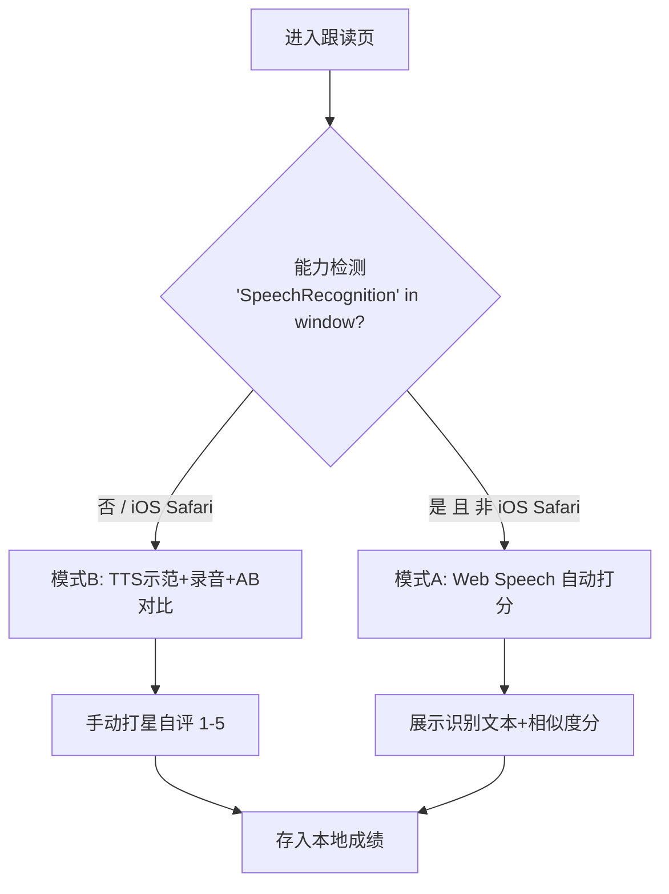

# 雅思 PWA 英语学习应用 — 简版 PRD（产品需求文档）

> 版本：v0.1（简版，无竞品分析）　|　产出：产品经理 许清楚　|　日期：2026-07-31
> 项目性质：**全新独立项目，不复用任何旧系统**。纯前端 PWA，无后端、无 API key、完全离线可用。

---

## 1. 产品目标

**一句话目标**：做一款手机优先、护眼有趣、可断点续学的离线雅思备考 PWA，让用户在碎片时间里把"单词-语法-阅读-写作-口语-测试"六大模块按六级难度闭环学完。

**核心目标（5 条）**：
1. **闭环学习**：六大模块 × 六级难度全覆盖，首版跑通"学→练→测→批改→续学"完整链路。
2. **零门槛离线**：无后端、无网络依赖，安装到桌面即可离线使用，进度本地持久化。
3. **护眼优先**：纸感米白底 + 墨灰字 + 苔绿主色，对比度达 WCAG AA 但不过冲，阅读态可深度定制。
4. **趣味反馈**：克制动效 + 打卡进度环 + 跟读波形，让坚持有正反馈（暖陶色仅用于正反馈）。
5. **兼容降级**：iPhone Safari 无语音识别时自动降级为"TTS+录音+AB对比+手动打星"自评，体验不中断。

---

## 2. 用户故事（按模块 / 难度）

1. As a **初中级碎片学习者**, I want 打开 App 直接看到我的上次进度, so that 我能无缝接上学习不重来。
2. As a **高中生**, I want 在单词卡上点一下就听到 TTS 示范音并翻牌看释义, so that 我能在通勤路上背词。
3. As a **大学生**, I want 阅读时开启专注模式（隐藏导航、行高 1.9、夜间墨屏）, so that 长时间阅读不刺眼不分心。
4. As a **雅思 5.5 分考生**, I want 写完后立刻看到本地规则批改（字数/段落/连接词/范文对照）, so that 我不用等老师也能自查。
5. As an **iPhone 用户**, I want 跟读时即使 Safari 不支持语音识别也能录音并 AB 对比、自己打星, so that 我的口语练习不被设备限制。
6. As a **雅思 6.0–6.5 分考生**, I want 做随堂测试后看到错题本并能重练, so that 我能针对性补弱。
7. As a **雅思 7 分+冲刺者**, I want 语法点带规则和例句、练习即时判分, so that 我能高效巩固高阶用法。
8. As a **所有用户**, I want 开启舒缓背景轻音乐（雨声/白噪/柔和琶音）并记住开关与音量, so that 学习氛围更放松、下次不用重设。
9. As a **夜猫子学习者**, I want 全局护眼配色且动效尊重系统"减弱动态效果", so that 不晕不累。
10. As a **坚持型用户**, I want 首页有连续打卡进度环随天数增长, so that 我有成就感、更愿意每天来。
11. As a **雅思 7 分+用户**, I want 跟读能自动语音识别打分（设备支持时）, so that 我知道自己的发音准确度。
12. As a **备考者**, I want 选难度后能清楚看到各模块内容量（如每级 100 词 / 8 语法点）, so that 我对学习量有预期、好规划。

---

## 3. 需求池（P0 / P1 / P2）

> 验收标准均要求可度量。优先级：P0=首版必须，P1=强烈建议，P2=后续。
> 模块代码：M1 单词 / M2 语法 / M3 阅读 / M4 写作 / M5 跟读口语 / M6 随堂测试 / P 平台通用。

| 编号 | 描述 | 模块 | 优先级 | 验收标准 |
|---|---|---|---|---|
| P0-01 | 单词卡浏览与记忆：每级 100 词，正面英文+音标，背面释义+例句，可标记"已掌握/学习中/未学" | M1 | P0 | 6 级 ×100 词数据齐全；翻牌交互 ≤300ms；三态可切换 |
| P0-02 | TTS 示范发音：点击单词/例句用 SpeechSynthesis 朗读，可重复播放 | M1 | P0 | 点击即播；支持语速调节；无报错 |
| P0-03 | 单词记忆状态持久化：状态写入 IndexedDB，重开 App 保留 | M1 | P0 | 关闭重开后状态 100% 还原 |
| P0-04 | 语法点讲解浏览：每级 8 个语法点，含规则 + 例句 | M2 | P0 | 6 级 ×8 点数据齐全；规则与例句同屏可见 |
| P0-05 | 语法练习 + 即时判分：选择题/填空，答完即时反馈对错 | M2 | P0 | 提交后 ≤200ms 出判分；错题标注正确项 |
| P0-06 | 阅读文章浏览：每级 4 篇，正文 + 理解题 | M3 | P0 | 6 级 ×4 篇数据齐全；正文渲染正常 |
| P0-07 | 专注阅读模式：隐藏导航、行高 1.9、字号三档、羊皮纸/夜间墨屏两底色 | M3 | P0 | 进入专注后导航隐藏；行高=1.9；夜间底色=#1C211E；三档字号生效 |
| P0-08 | 阅读答题与即时判分 | M3 | P0 | 提交即判分；正确率可记录 |
| P0-09 | 写作题目展示（每级 3 题）+ 多行文本输入 | M4 | P0 | 6 级 ×3 题齐全；输入区支持中文/英文混排 |
| P0-10 | 本地规则批改：字数统计、段落结构检查、连接词/高分句式提示、范文逐段对照 | M4 | P0 | 无网络/无 key 可跑；字数精确；至少提示连接词缺失；范文可逐段展开 |
| P0-11 | 跟读 TTS 示范音播放 | M5 | P0 | 示范句可朗读；可循环 |
| P0-12 | 录音（MediaRecorder）+ AB 对比回听 | M5 | P0 | 可录可播；A(原音)/B(我的)可切换对比 |
| P0-13 | 跟读评分双模式封装：能力检测 Web Speech 自动打分；iOS Safari 降级为手动打星自评 | M5 | P0 | 检测到 SpeechRecognition 走自动打分；否则仅出现打星；封装统一接口 |
| P0-14 | 随堂测试套卷：每级 4 套，混合题型 | M6 | P0 | 6 级 ×4 套齐全；题型含选择/填空/阅读/写作类 |
| P0-15 | 测试计时 / 交卷 / 得分 | M6 | P0 | 可计时；交卷出总分与分项；≤200ms |
| P0-16 | 错题本与重练 | M6 | P0 | 错题可汇总查看；可一键重练 |
| P0-17 | 难度选择入口（六级）+ 模块总览首页 | P | P0 | 六级卡片可进；首页展示六模块入口与总进度 |
| P0-18 | 断点续学：Zustand persist → IndexedDB，恢复上次位置（模块/难度/具体进度） | P | P0 | 冷启动 ≤1s 恢复；精确回到末次页面与进度 |
| P0-19 | PWA 安装 + App Shell 离线：vite-plugin-pwa 预缓存，可加桌面、离线可用 | P | P0 | Lighthouse PWA 通过；离线刷新首屏可加载 |
| P0-20 | 护眼主题 token 系统：纸感米白#FDFBF7 / 墨灰#2E3330 / 苔绿主色 / 暖陶色强调；全局尊重"减弱动态" | P | P0 | 正文对比度 ≥ WCAG AA；暖陶色仅用于正反馈；减弱动态下动效关闭 |
| P0-21 | 背景音乐实时合成：雨声/白噪/柔和琶音三档，Web Audio 生成，开关+音量+记忆 | P | P0 | 零音频文件；三档可切；开关与音量持久化；首次需用户手势触发 |
| P1-01 | 单词卡翻牌手感动效（spring ≤300ms） | M1 | P1 | 翻牌有弹性反馈；尊重减弱动态 |
| P1-02 | 单词复习轮换：基于记忆状态优先推"学习中/未学" | M1 | P1 | 复习队列优先未掌握词 |
| P1-03 | 语法错题记录与回顾 | M2 | P1 | 错题可查可重做 |
| P1-04 | 阅读进度记忆（读到哪一段/句） | M3 | P1 | 重开回到上次段落 |
| P1-05 | 写作草稿本地保存（防丢失） | M4 | P1 | 输入自动暂存；重开可恢复草稿 |
| P1-06 | 跟读波形动画（录音/播放实时波形） | M5 | P1 | 录音时 Canvas 波形实时绘制 |
| P1-07 | 测试成绩分布与趋势 | M6 | P1 | 各模块得分可图形化展示 |
| P1-08 | 连续打卡进度环（随天数增长） | P | P1 | 首页环形进度随连续天数增长；断签重置 |
| P1-09 | 首页趣味动效（模块卡入场、进度增长） | P | P1 | 入场动效 ≤300ms；克制不花哨 |
| P2-01 | 词库/题库扩充导入接口 | M1/M2/M3/M4/M5/M6 | P2 | 提供 JSON 导入规范，内容可持续扩充 |
| P2-02 | 阅读划词查词（长按取词） | M3 | P2 | 长按单词弹出释义 |
| P2-03 | 历史作文查看与对比 | M4 | P2 | 可回看往期作文与批改 |
| P2-04 | 跟读成绩趋势曲线 | M5 | P2 | 多次跟读分数可折线展示 |
| P2-05 | 全真模考流程（限时全卷） | M6 | P2 | 模拟真实考试节奏 |
| P2-06 | 无障碍增强（屏幕阅读器标签、字号系统级联动） | P | P2 | 主要交互有 aria 标签 |

### 六大模块 P0 数量统计

| 模块 | P0 数量 | 编号 |
|---|---|---|
| M1 单词 | 3 | P0-01, P0-02, P0-03 |
| M2 语法 | 2 | P0-04, P0-05 |
| M3 阅读 | 3 | P0-06, P0-07, P0-08 |
| M4 写作 | 2 | P0-09, P0-10 |
| M5 跟读口语 | 3 | P0-11, P0-12, P0-13 |
| M6 随堂测试 | 3 | P0-14, P0-15, P0-16 |
| **模块合计** | **16** | — |
| 平台通用 P | 5 | P0-17~P0-21 |
| **P0 总计** | **21** | — |

---

## 4. UI 设计稿（关键页面 + 护眼配色 token 应用）

### 4.1 护眼配色 token（硬指标，全站统一引用）

| Token | 值 | 用途 | 约束 |
|---|---|---|---|
| `--bg-paper` | `#FDFBF7` | 全局底色（纸感米白，非纯白） | 所有页面默认底 |
| `--text-ink` | `#2E3330` | 正文墨灰（非纯黑） | 正文/标题文字 |
| `--primary-moss` | 苔绿（中低饱和） | 主色：按钮/选中态/导航/进度 | 不用高饱和、不用霓虹 |
| `--accent-terracotta` | 暖陶色 | 强调**仅用于正反馈**：答对/达成/解锁 | 禁止用于普通装饰 |
| `--bg-night` | `#1C211E` | 阅读夜间墨屏（降饱和深墨绿灰） | 仅专注阅读夜间态 |
| `--line-height-read` | `1.9` | 专注阅读行高 | 仅阅读专注模式 |

> 对比度：墨灰#2E3330 on 米白#FDFBF7 ≈ 11:1，远超 WCAG AA(4.5:1)；夜间墨屏文字用米白反色，同样达标。

### 4.2 首页（Home）— `--bg-paper` 底，`--primary-moss` 导航

```
┌─────────────────────────────┐
│  🌿 雅思 PWA        [♪音乐]  │  ← 顶栏：苔绿图标 + 音乐开关(记忆状态)
│                             │
│   ┌─────────────────────┐   │
│   │  连续打卡进度环 12天 │   │  ← P1-08 环形进度(Framer Motion spring)
│   └─────────────────────┘   │
│   上次学到：高中 · 阅读 L3   │  ← P0-18 断点续学提示
│   [▶ 继续学习]              │  ← 暖陶色主按钮(正反馈引导)
│                             │
│   六大模块入口（2×3 卡片）   │
│  [单词][语法][阅读][写作]    │  ← 卡片：米白底+苔绿描边
│  [跟读][测试]               │
└─────────────────────────────┘
```

### 4.3 难度选择页（Level Select）— 六级纵向卡片

```
┌─────────────────────────────┐
│  选择难度                    │
│  ┌───────────────────────┐  │
│  │ 初中      进度 80% ▓▓▓░ │  │  ← 进度条苔绿填充
│  ├───────────────────────┤  │
│  │ 高中      进度 45% ▓▓░░ │  │
│  ├───────────────────────┤  │
│  │ 大学      ···          │  │
│  ├───────────────────────┤  │
│  │ 雅思5.5  ···          │  │
│  ├───────────────────────┤  │
│  │ 雅思6.0-6.5 ···       │  │
│  ├───────────────────────┤  │
│  │ 雅思7分+  ···          │  │
│  └───────────────────────┘  │
│  每级内容量：100词/8语法/    │  ← P0-12 用户故事12 的内容预期
│  4阅读/3写作/4测试           │
└─────────────────────────────┘
```

### 4.4 模块学习页（通用骨架）— 单词/语法示例

```
┌─────────────────────────────┐
│ ← 返回   高中 · 单词 (12/100)│  ← 顶部进度
│  ┌───────────────────────┐  │
│  │  [单词卡 正面]          │  │  ← P0-01 翻牌
│  │  environment           │  │
│  │  /ɪnˈvaɪrənmənt/  [🔊] │  │  ← P0-02 TTS
│  │   [点此翻面]            │  │
│  └───────────────────────┘  │
│  [✓已掌握] [↻学习中] [○未学]│  ← P0-03 三态
│  [上一词]      [下一词 ▶]    │
└─────────────────────────────┘
```

### 4.5 专注阅读页（Focus Reading）— `--bg-night` 夜间态

```
正常(羊皮纸) / 夜间(墨屏#1C211E) 二选一，行高1.9，字号三档
┌─────────────────────────────┐  ← 导航已隐藏(P0-07)
│ 文章：The Quiet Ocean  (18px)│  ← 字号: 17/18/20 三档
│                             │
│  Paragraph text line one... │  ← line-height:1.9
│  Paragraph text line two... │
│  ···（长文滚动）···          │
│  [☀️/🌙 切换底色] [A- A+ 字号]│  ← 仅在阅读内可呼出迷你控件
│  [✓ 完成并答题]             │
└─────────────────────────────┘
```

### 4.6 跟读页（Follow-read）— 双模式

```
┌─────────────────────────────┐
│ 高中 · 跟读   示范句:         │
│ "The environment is changing"│
│ [🔊 TTS示范]                 │  ← P0-11
│  ┌─ 波形动画 ────────────┐   │  ← P1-06 Canvas波形
│  │ ▁▂▃▅▇▆▄▂▁  (实时绘制)  │   │
│  └────────────────────────┘  │
│ [● 录音]  [▶ A原音][▶ B我的] │  ← P0-12 AB对比
│                             │
│ 模式A(支持语音识别): 自动打分 78分 │ ← P0-13 自动
│ 模式B(iOS降级):  [★★★☆☆ 打星]   │ ← P0-13 自评
└─────────────────────────────┘
```

### 4.7 写作批改页（Writing Correction）— 本地规则

```
┌─────────────────────────────┐
│ 大学 · 写作题1               │
│ 题目：Some people think...   │  ← P0-09
│ ┌─────────────────────────┐ │
│ │ 输入框（草稿自动保存P1-05）│ │
│ │ I think the environment… │ │
│ └─────────────────────────┘ │
│ [本地批改]                   │  ← P0-10 无网络
│ ├ 字数：186 (建议≥150) ✓    │
│ ├ 段落：3段，结构完整 ✓      │
│ ├ 连接词提示：缺 however/thus│
│ ├ 高分句式：可加强调句       │
│ └ 范文逐段对照 ▸ [展开]      │
└─────────────────────────────┘
```

### 4.8 进度页（Progress）— 模块×难度

```
┌─────────────────────────────┐
│ 我的进度                     │
│ 打卡环 ●●●● 12天 (P1-08)    │
│ ┌─────────────────────────┐ │
│ │ 模块 │ 初中│高中│…│7分+  │ │  ← 矩阵热力(苔绿深浅表进度)
│ │ 单词 │ 80%│45%│…│ 0%   │ │
│ │ 语法 │ 60%│30%│…│ 0%   │ │
│ │ 阅读 │ ···                │ │
│ │ 写作 │ ···                │ │
│ │ 跟读 │ ···                │ │
│ │ 测试 │ ···                │ │
│ └─────────────────────────┘ │
│ 测试成绩分布 ▁▂▅▇ (P1-07)     │
└─────────────────────────────┘
```

### 4.9 跟读双模式降级判定（Mermaid 流程图）



### 4.10 内容规模矩阵（六级 × 模块，P0 数据基线）

| 难度 \ 模块 | 单词 | 语法 | 阅读 | 写作 | 跟读 | 测试 |
|---|---|---|---|---|---|---|
| 初中 | 100 | 8 | 4 | 3 | 4 | 4 |
| 高中 | 100 | 8 | 4 | 3 | 4 | 4 |
| 大学 | 100 | 8 | 4 | 3 | 4 | 4 |
| 雅思5.5 | 100 | 8 | 4 | 3 | 4 | 4 |
| 雅思6.0-6.5 | 100 | 8 | 4 | 3 | 4 | 4 |
| 雅思7分+ | 100 | 8 | 4 | 3 | 4 | 4 |

> 首版"精选版"跑通全流程，内容经 P2-01 导入接口可持续扩充。

---

## 5. 待确认问题（Open Questions）

1. **内容来源**：六级 × 各模块的精选内容（100词/8语法点/4阅读/3写作/4测试）由谁产出？是产品经理提供文案、还是架构师先用占位数据（placeholder）跑通？建议首版先用结构化占位数据，文案后续由内容方填充（P2-01 接口已预留）。
2. **阅读"理解题"题型**：P0-08 阅读答题默认采用选择题还是开放题？开放题无法离线判分，建议首版阅读题用选择题/判断题以保证离线判分闭环。
3. **写作范文对照**：P0-10 的"范文逐段对照"需要每题配一篇范文，范文是否随内容包一同提供？若暂缺，首版可先上"结构+连接词+句式提示"，范文作为 P1 后续。
4. **背景音乐首次触发**：Web Audio 需用户手势激活（浏览器策略）。是否将"首次进入弹窗引导开启音乐"纳入 P0-21 验收？建议是。
5. **打卡口径**：P1-08 连续打卡以"打开 App"还是"完成至少 1 个学习动作"计为打卡？建议以"完成≥1个模块动作"计，防作弊式打卡。
6. **iPad / 大屏适配**：当前定位"手机优先"，是否首版仅做移动端竖屏（max-width 容器），平板/桌面仅做居中窄屏？建议首版不做响应式多列，专注移动端。
7. **数据迁移**：IndexedDB 内容结构变更时（后续扩充）是否需要迁移脚本？建议首版加 schema version 字段，P2 再补迁移。

---

## 附录：技术约束（主理人锁定，PRD 注明，详细架构由架构师产出）

- 框架：Vite + React 18 + TypeScript
- 样式：Tailwind CSS + Framer Motion（**不引入 MUI**）
- 路由：HashRouter（GitHub Pages 子路径刷新不 404）
- 状态/存储：Zustand + persist → IndexedDB（断点续学核心）
- PWA：vite-plugin-pwa（Workbox）预缓存 App Shell，离线可用、可加桌面
- 语音：SpeechSynthesis（示范音）+ MediaRecorder（录音）；跟读评分 Web Speech API（能力检测降级）
- 音乐：Web Audio 实时合成（雨声/白噪/柔和琶音）
- 部署：GitHub Actions → GitHub Pages，仓库 `MisterCharlesxiong/ielts-pwa`，`base=/ielts-pwa/`，线上 `https://mistercharlesxiong.github.io/ielts-pwa/`
